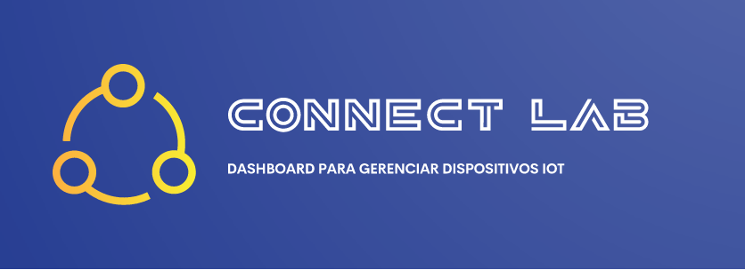
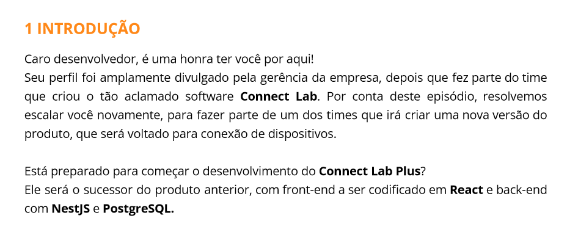
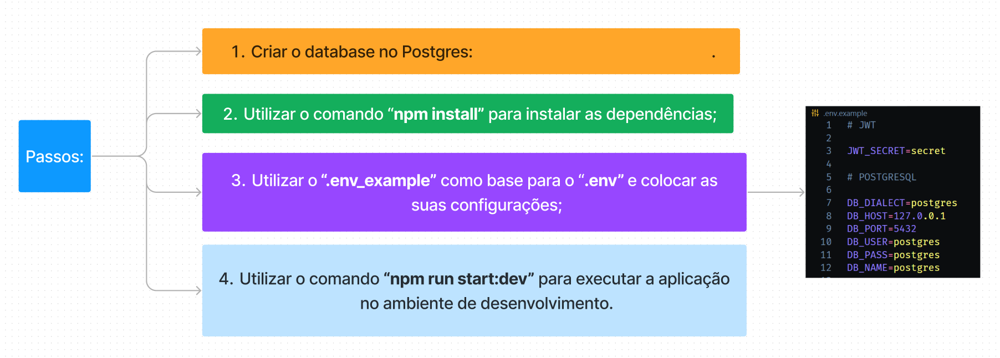
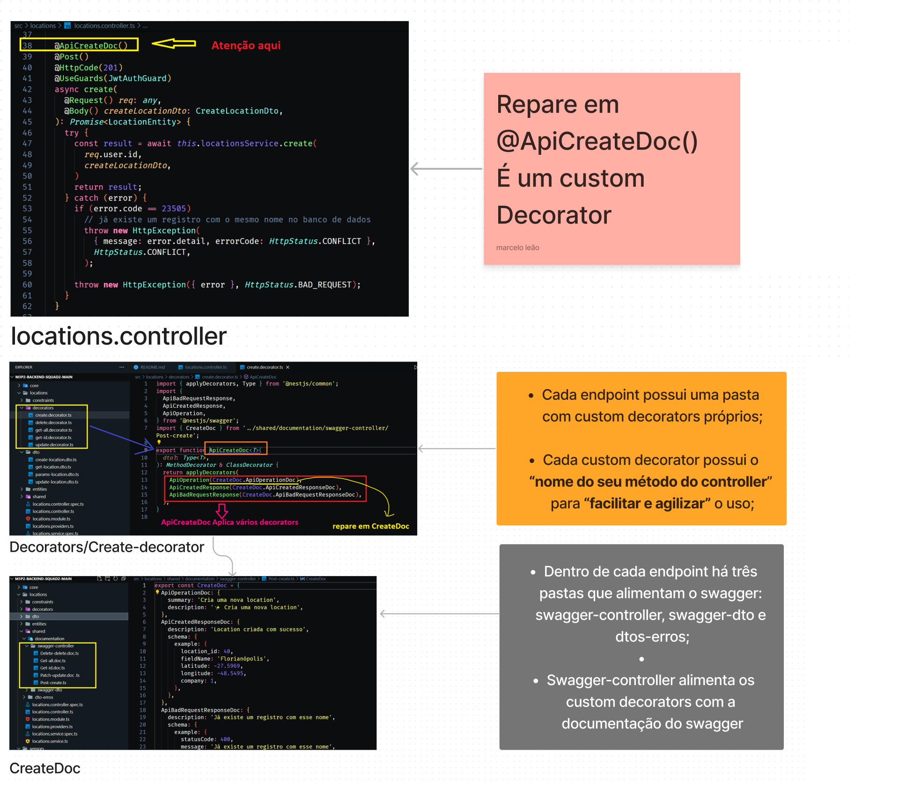
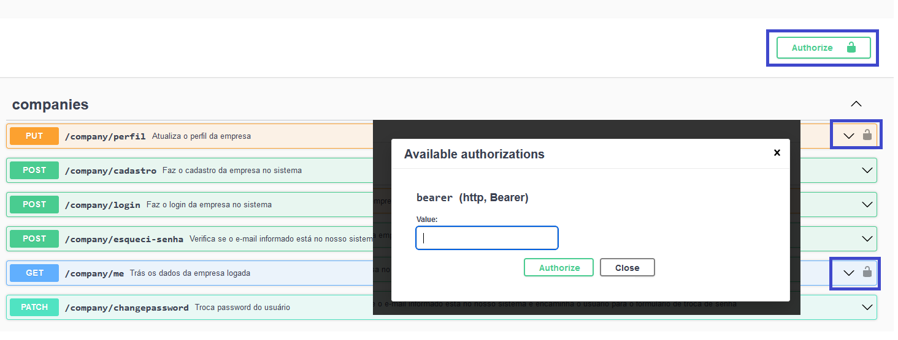
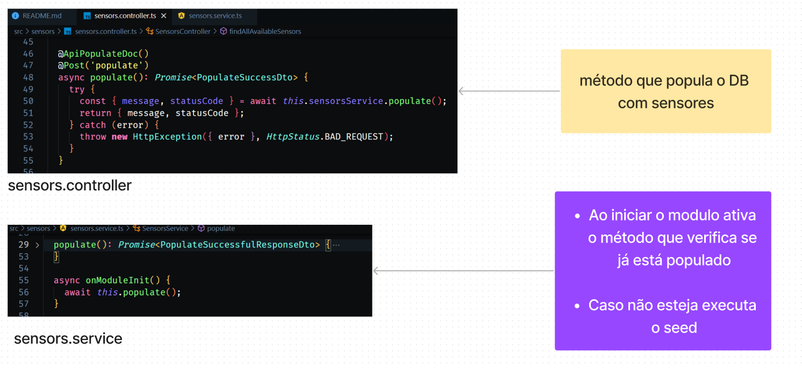
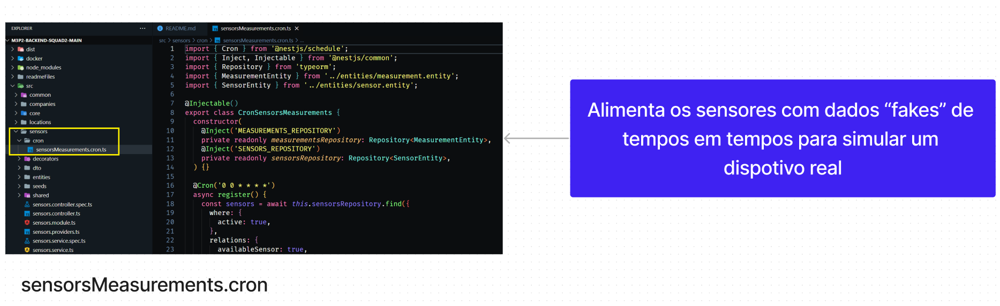
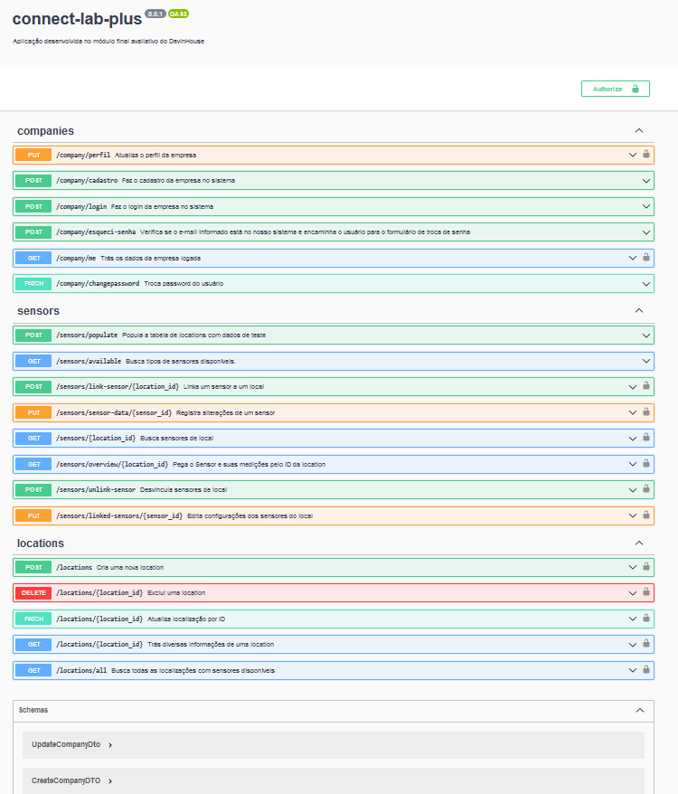
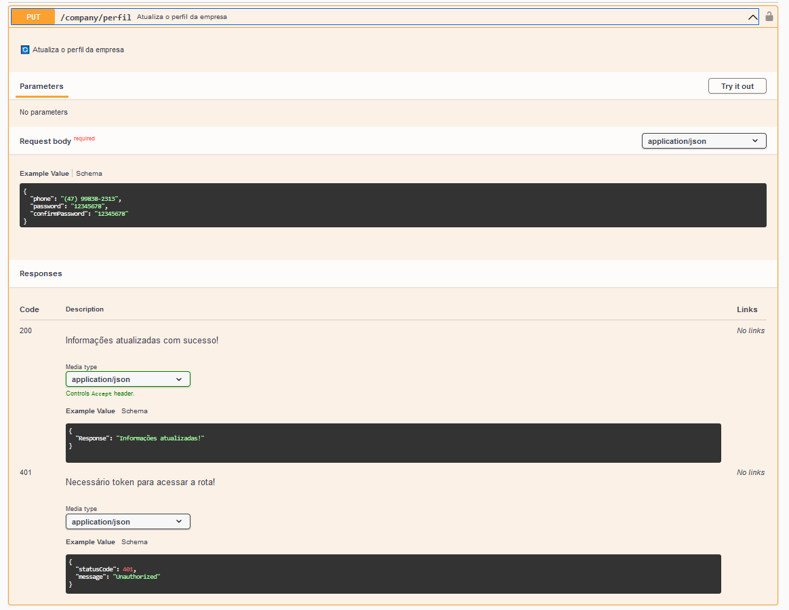

  

# Introdução 📖

Após 9 meses de curso no devinHouse, chegamos neste desafio final. O projeto final consiste em desenvolver uma API para gerenciar IOTs de fazendas inteligentes.

O Projeto foi feito em grupo, com 4 integrantes. O grupo foi composto por::
- [Eu (Marcelo)](https://www.linkedin.com/in/marcelo-campos-fullstack/);
- [Francisko](https://www.linkedin.com/in/francisko-rezende/);
- [Eduarda](https://www.linkedin.com/in/eduarda-garcia-franderlinde-4183b3259/);
- [Théo](https://www.linkedin.com/in/th%C3%A9o-barreto-silva/);

A API foi desenvolvida utilizando o framework Nest.js, com o banco de dados Postgres e o ORM Typeorm. A documentação da API foi feita utilizando o Swagger com a especificação Openapi 3.0.0.

<strong> Print da introdução ao projeto 🎞</strong> 

  

  

# Sumário 📑

- [Tecnologias 💻](#tecnologias-💻)
- [Pré-requisitos recomendáveis 🛠️](#pré-requisitos-recomendáveis-🛠️)
- [Como usar 🤔](#como-usar-🤔)
- [Banco de dados 🗄️](#banco-de-dados-🗄️)
- [Features 📌](#features-📌)
- [Swagger 📚](#swagger-📚)
- [Apresentação](#apresentação)

## Tecnologias 💻

    - Node; 🟩
    - Nest.js; 🟪
    - Typeorm; 🗄️
    - Swagger 📖
    - Postgres; 🐘

## Pré-requisitos recomendáveis 🛠️

- Node.js - Versão 18.15.0
- Postgres instalado e rodando na porta 5432

## Como usar 🤔

Para usar o projeto, siga as seguintes etapas:

  

<strong> Instruções em texto</strong> 

1. Criar o database no Postgres, para utilizar no projeto;

2. Utilizar o comando `npm install` para instalar as dependências;

3. Utilizar o `.env_example` como base para o `.env` e colocar as suas configurações;

4. Utilizar o comando `npm run migration:run` para criar as tabelas após a configuração das variáveis de ambiente no passo 3

5. Utilizar o comando `npm run start:dev` para executar a aplicação no ambiente de desenvolvimento.

  

## Banco de dados 🗄️

O banco de dados utilizado foi o Postgres, com o ORM Typeorm. O banco de dados possui 5 tabelas: Companies, Locations, Sensors, Measurements, avaliable_sensors

  

# Features Especiais 📌

<strong> Arquitetura da Documentação do Swagger bem planejada e execultada;</strong> 

<h6>Controller:</h6>
  

<h6>DTO:</h6>
  

<strong> JWT; </strong> 

<strong>Seed; </strong> 

 

<strong> CRON Jobs; </strong> 

 

## Swagger 📚

A documentação da API utiliza Swagger com a especificação `Openapi 3.0.0`, na rota /api-docs.

[Swagger 📖](http://localhost:3000/api-docs)

<strong> Imagem overview do Swagger </strong> 

<strong> Imagem de um método do Swagger </strong> 

 

---

## Apresentação

[Acesse nossa apresentação aqui](https://www.canva.com/design/DAFhNBvpYAU/rVRJDP_RtE25C9a3_jnPlQ/view)
